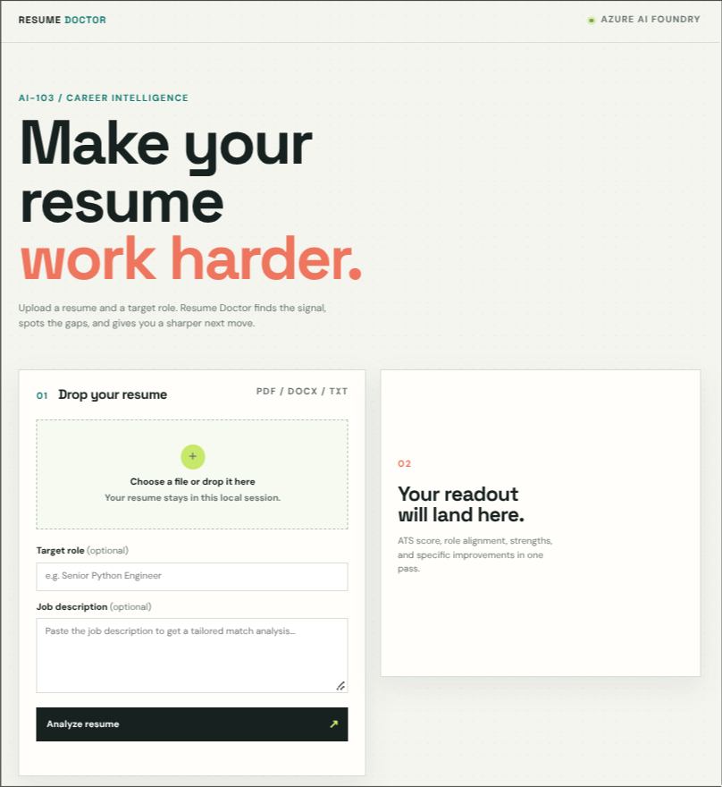

# Resume Doctor — Agentic Edition (Azure AI-103)

A genuinely **agentic** rewrite of the AI-103 "Resume Doctor" lab. Instead of a
hand-wired Python pipeline (`asyncio.gather`), an **Azure AI Foundry Agent Service
supervisor agent** decides at runtime which of the 4 module **worker functions** to
call, in which order, and assembles the final `MasterAnalyzeResponse`.

```
 ┌───────────────────────────────────────────────────────────────┐
 │  Azure AI Foundry Agent Service (supervisor agent)            │
 │  model: gpt-4.1-mini, name: resume-doctor                     │
 │  decides tool call order itself at runtime                    │
 └───────────────┬───────────────────────────────────────────────┘
                 │  OpenAI Responses loop (function tools)
        ┌────────┴────────┬──────────────┬───────────────┐
        ▼                 ▼              ▼               ▼
  parse_resume      redact_pii       score_ats       match_jd
  (DocIntel)      (AI Language)   (Azure OpenAI)   (TF-IDF+Cosine)
```

Resume bytes live on a per-request `ToolContext` (the agent passes only JSON args,
so tools receive the filename; offline mock always works with zero Azure keys).

## Demo & Screenshots

### Dashboard Preview


### Video Demos

<details>
<summary>🎥 <b>Watch Resume Audit Demo (Part 1)</b></summary>

<video src="docs/assets/resume_analysis.mp4" controls width="100%"></video>

</details>

<details>
<summary>🎥 <b>Watch Resume Audit Demo (Part 2)</b></summary>

<video src="docs/assets/resume_analysis2.mp4" controls width="100%"></video>

</details>

## Repo Layout

| Path | Purpose |
|---|---|
| `src/backend/agents/function_tools.py` | 4 module tool functions + OpenAI `FunctionTool` definitions + dispatcher |
| `src/backend/agents/agent_service.py` | Supervisor-agent Responsive loop, 3-mode fallback, trace capture |
| `src/backend/orchestrator.py` | Deterministic `MasterOrchestrator` — kept as the **offline fallback** |
| `src/backend/app.py` | FastAPI gateway; `/api/analyze` routes through the agent |
| `frontend/` | React (Vite) + Lucide Icons UI with dynamic backend health status badge |
| `tests/test_agent.py` | Agent loop harness (scripted, no network) + opt-in LIVE test |

## Modes

| Mode | Indicator | Trigger | What runs |
|---|---|---|---|
| **agent_service** | `AZURE AI FOUNDRY` | `AZURE_AI_PROJECT_ENDPOINT` set, `FORCE_OFFLINE=0` | Foundry agent service + Responses function-tool loop |
| **responses** (stateless) | `AZURE OPENAI RESPONSES` | agent platform fails at runtime | `get_openai_client()` + tools passed per request |
| **offline** | `LOCAL WORKSPACE` / `API Connected` | endpoint unset or `FORCE_OFFLINE=1` | `MasterOrchestrator` (deterministic, no Azure needed) |

`GET /api/agent/trace` returns the last run's tool-call order + agent summary
(useful for the demo deck: *"the agent chose parse → redact → score → match"*).

## Quickstart & Running Locally

### 1. Backend Server (FastAPI)

```bash
python3 -m venv venv && source venv/bin/activate
pip install -r requirements.txt
FORCE_OFFLINE=1 uvicorn src.backend.main:app --reload --port 8000
```

Verify backend health and offline analysis:
```bash
curl -s -F "file=@tests/sample_resumes/sample_resume_testing.pdf" \
     -F "job_description=Python Developer with FastAPI, Docker, Azure, Git and PostgreSQL." \
     http://localhost:8000/api/analyze | python -m json.tool
curl -s http://localhost:8000/api/agent/trace | python -m json.tool
```

### 2. Frontend Development Server (React + Vite)

```bash
cd frontend
npm install
npm run dev
```
Open [http://localhost:5173](http://localhost:5173) in your browser.

---

## Enable the Live Supervisor Agent

1. **Provision** an Azure AI Foundry project: sign in at `ai.azure.com`, create a
   project (hub), and deploy a chat model (e.g. `gpt-4.1-mini`).
2. Copy `.env.example` → `.env` and set `AZURE_AI_PROJECT_ENDPOINT` (project
   **Overview → Project endpoint**) and `AZURE_AI_MODEL_DEPLOYMENT_NAME`.
3. Provide the same-scope keys for the three AI service tools
   (`AZURE_DOC_INTEL_*`, `AZURE_AI_LANG_*`, `AZURE_OPENAI_*`).
4. Authenticate with
   [`DefaultAzureCredential`](https://learn.microsoft.com/en-us/python/api/azure-identity/azure.identity.defaultazurecredential)
   — `az login` (Azure CLI) works out of the box; set the right subscription/target the project.
5. Start the server. On the first request the supervisor agent is registered on
   the platform and drives the tools. Watch the order in `/api/agent/trace`.

---

## How to Include Images & Demo Videos in README

To showcase screenshots or screen recordings directly in GitHub:

### Option 1: Commit Assets in Repository (Recommended)
1. Create an assets directory:
   ```bash
   mkdir -p docs/assets
   ```
2. Save your screenshots (`dashboard.png`) or recorded video (`demo.mp4` / `demo.gif`) into `docs/assets/`.
3. Embed in `README.md`:

   **For Images (PNG/JPG/GIF):**
   ```markdown
   
   ```

   **For Videos (MP4/WebM):**
   ```html
   <video src="docs/assets/demo.mp4" controls width="100%"></video>
   ```

### Option 2: GitHub Drag & Drop (Easiest for Videos/GIFs)
1. Go to any GitHub Issue or Pull Request comment box.
2. Drag and drop your image or video file (`.mp4`, `.mov`, `.gif`, `.png`).
3. GitHub automatically uploads the file and generates a markdown/HTML snippet like:
   ```markdown
   https://github.com/user-attachments/assets/xxxx-xxxx-xxxx
   ```
4. Copy that snippet and paste it directly into your `README.md`.

---

## Tests

```bash
# Hermetic offline suite (no Azure keys required)
venv/bin/pytest -q

# Live integration — only when a real project endpoint is available
export AZURE_AI_PROJECT_ENDPOINT=https://<your-project>.eastus2.aiservices.azure.com/
az login
venv/bin/pytest -q -m slow
```

51 tests cover the 4 worker tools offline, the agent loop (scripted fake client),
deterministic assembly, and the FastAPI gateway.

## Responsible AI

See `docs/responsible_ai.md` for the fairness/transparency notes that ship with
this lab edition.