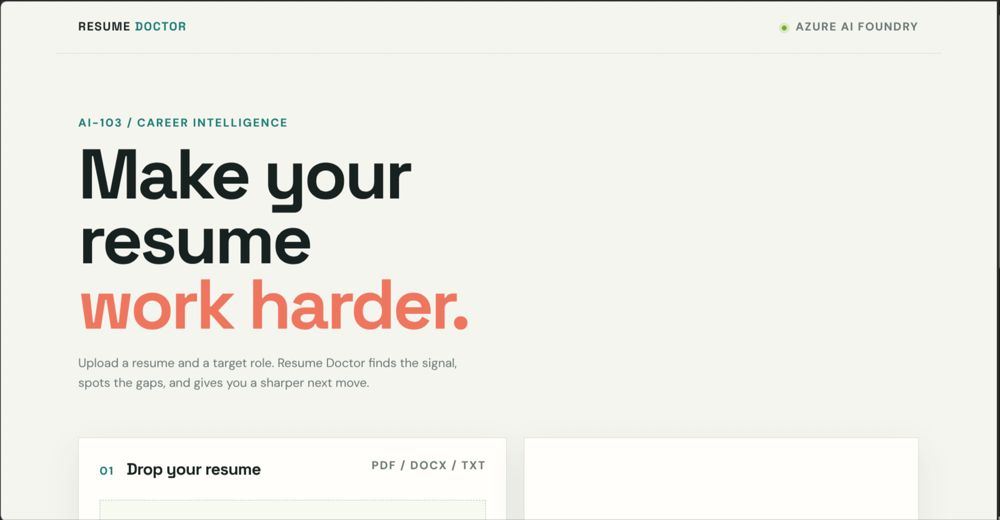
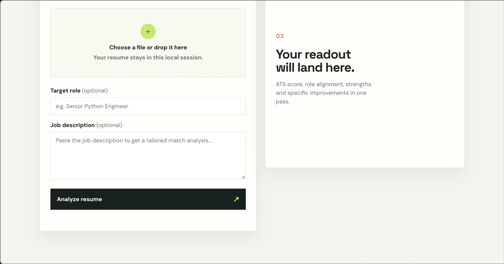
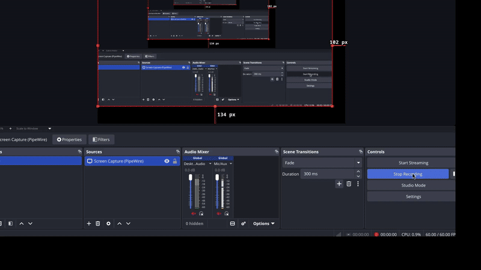
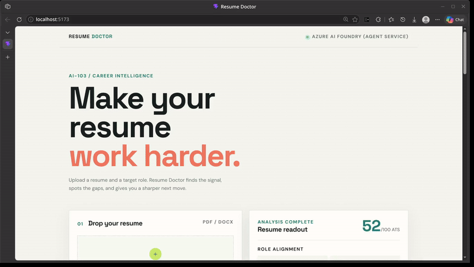

# Resume Doctor — Agentic Edition (Azure AI-103)

A genuinely **agentic** rewrite of the AI-103 "Resume Doctor" lab. Instead of a
hand-wired Python pipeline (`asyncio.gather`), an **Azure AI Foundry Agent Service
supervisor agent** decides at runtime which of the 4 module **worker functions** to
call, in which order, and assembles the final `MasterAnalyzeResponse`.

```
 ┌───────────────────────────────────────────────────────────────┐
 │  Azure AI Foundry Agent Service (supervisor agent)            │
 │  model: gpt-4.1-mini, name: resume-doctor                     │
 │  decides tool call order itself at runtime                    │
 └───────────────┬───────────────────────────────────────────────┘
                 │  OpenAI Responses loop (function tools)
        ┌────────┴────────┬──────────────┬───────────────┐
        ▼                 ▼              ▼               ▼
  parse_resume      redact_pii       score_ats       match_jd
  (DocIntel)      (AI Language)   (Azure OpenAI)   (TF-IDF+Cosine)
```

Resume bytes live on a per-request `ToolContext` (the agent passes only JSON args,
so tools receive the filename; offline mock always works with zero Azure keys).

---

## Demo & Screenshots

### Dashboard Previews




### Live Demo Animations




---

## Repo Layout

| Path | Purpose |
|---|---|
| `src/backend/agents/function_tools.py` | 4 module tool functions + OpenAI `FunctionTool` definitions + dispatcher |
| `src/backend/agents/agent_service.py` | Supervisor-agent Responsive loop, 3-mode fallback, trace capture |
| `src/backend/orchestrator.py` | Deterministic `MasterOrchestrator` — kept as the **offline fallback** |
| `src/backend/main.py` / `app.py` | FastAPI gateway; `/api/analyze` routes through the agent |
| `frontend/` | React (Vite) + Lucide Icons UI with dynamic backend health status badge |
| `tests/test_agent.py` | Agent loop harness (scripted, no network) + opt-in LIVE test |

---

## Execution Modes

| Mode | UI Status Indicator | Trigger | What Runs |
|---|---|---|---|
| **agent_service** | `AZURE AI FOUNDRY` | `AZURE_AI_PROJECT_ENDPOINT` set, `FORCE_OFFLINE=0` | Foundry agent service + Responses function-tool loop |
| **responses** (stateless) | `AZURE OPENAI RESPONSES` | Agent platform fails at runtime | `get_openai_client()` + tools passed per request |
| **offline** | `LOCAL WORKSPACE` / `API Connected` | Endpoint unset or `FORCE_OFFLINE=1` | `MasterOrchestrator` (deterministic mock, zero Azure keys needed) |

`GET /api/agent/trace` returns the last run's tool-call order + agent summary
(useful for demoing: *"the agent chose parse → redact → score → match"*).

---

## Run Instructions

### Option A: Local / Offline Mode (0 Azure Credentials Required)

Runs using the deterministic mock engine. Ideal for local UI development and testing.

1. **Start Backend (FastAPI)**:
   ```bash
   python3 -m venv venv && source venv/bin/activate
   pip install -r requirements.txt
   FORCE_OFFLINE=1 uvicorn src.backend.main:app --reload --port 8000
   ```

2. **Start Frontend (React + Vite)**:
   ```bash
   cd frontend
   npm install
   npm run dev
   ```
   Open [http://localhost:5173](http://localhost:5173) in your browser.

3. **Verify via CLI**:
   ```bash
   curl -s -F "file=@tests/sample_resumes/sample_resume_testing.pdf" \
        -F "job_description=Python Developer with FastAPI, Docker, Azure, Git and PostgreSQL." \
        http://localhost:8000/api/analyze | python -m json.tool
   curl -s http://localhost:8000/api/agent/trace | python -m json.tool
   ```

---

### Option B: Normal / Live Azure Production Mode (Azure AI Foundry Agent)

Runs the live AI supervisor agent with Azure Document Intelligence, Azure AI Language (PII), and Azure OpenAI.

1. **Provision Azure Services**:
   - Sign in at [ai.azure.com](https://ai.azure.com) and create an Azure AI Foundry project.
   - Deploy a chat model (e.g. `gpt-4.1-mini`).
   - Provision Azure Document Intelligence and Azure AI Language resources.

2. **Configure Environment (`.env`)**:
   Copy `.env.example` → `.env` and set:
   ```env
   AZURE_AI_PROJECT_ENDPOINT=https://<your-project>.eastus2.aiservices.azure.com/
   AZURE_AI_MODEL_DEPLOYMENT_NAME=gpt-4.1-mini
   AZURE_DOC_INTEL_ENDPOINT=...
   AZURE_DOC_INTEL_KEY=...
   AZURE_AI_LANG_ENDPOINT=...
   AZURE_AI_LANG_KEY=...
   AZURE_OPENAI_ENDPOINT=...
   AZURE_OPENAI_API_KEY=...
   FORCE_OFFLINE=0
   ```

3. **Authenticate with Azure CLI**:
   ```bash
   az login
   ```

4. **Launch Backend & Frontend**:
   ```bash
   # Terminal 1: Backend
   source venv/bin/activate
   uvicorn src.backend.main:app --reload --port 8000

   # Terminal 2: Frontend
   cd frontend
   npm run dev
   ```

---

## Tests

```bash
# Hermetic offline suite (no Azure keys required)
venv/bin/pytest -q

# Live integration test suite (requires active Azure credentials)
export AZURE_AI_PROJECT_ENDPOINT=https://<your-project>.eastus2.aiservices.azure.com/
az login
venv/bin/pytest -q -m slow
```

51 tests cover the 4 worker tools offline, the agent loop (scripted fake client),
deterministic assembly, and the FastAPI gateway.

---

## Responsible AI

See `docs/responsible_ai.md` for fairness/transparency guidelines that ship with
this lab edition.