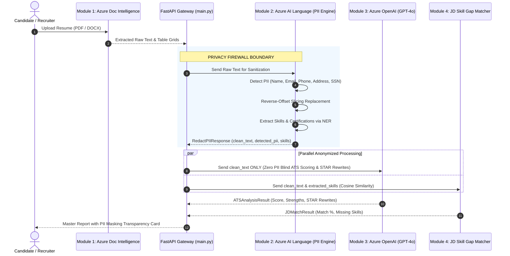

# Responsible AI & Data Privacy Architecture Specification

## Executive Overview
**Resume Doctor** is engineered with Responsible AI by design. In automated talent screening, algorithmic bias, demographic discrimination, and Personally Identifiable Information (PII) leakage represent significant ethical and legal liabilities. 

This document defines the architectural standards, technical safeguards, and governance frameworks implemented across Resume Doctor in strict alignment with the **Microsoft Responsible AI Standard (v2)**, **GDPR**, **CCPA**, and **EEOC Guidelines**.

---

## 1. System Architecture & Secure Data Flow

The following sequence illustrates how **Module 2 (Azure AI Language)** acts as an impenetrable privacy firewall between raw resume parsing and generative downstream models:



---

## 2. Reverse-Offset Slicing Algorithm

### The Token Displacement Problem
When replacing text dynamically, entity lengths vary widely. For example, replacing `"Christopher Alexander Montgomery"` (34 characters) with `"[NAME]"` (6 characters) shrinks the document by 28 characters. 

If replacements occur from start-to-end, every subsequent entity's character index drifts, leading to severe text corruption, sliced words, or unredacted PII leakage.

### The Algorithmic Guarantee
To mathematically eliminate index drift, Module 2 executes **reverse-offset slicing**:
1. Azure AI Language detects all PII entities with their character `offset` and `length`.
2. All entities are sorted in **strictly descending order of offset**:
   $$\text{offset}_N > \text{offset}_{N-1} > \dots > \text{offset}_1$$
3. String replacements are applied from the end of the text toward the beginning:
   ```python
   clean_text = clean_text[:ent.offset] + tag + clean_text[ent.offset + ent.length:]
   ```
4. **Outcome**: Because replacements only alter text *after* the current offset, the indices of all preceding entities remain 100% stable.

---

## 3. PII Masking & NER Entity Reference

The following table documents the entity categories detected, mapped, and redacted by Module 2:

| Azure PII Category | Replacement Tag | Detection Mechanism | Example Matched Input | Privacy Impact |
| :--- | :--- | :--- | :--- | :--- |
| `Person` / `PersonType` | `[NAME]` | Azure AI Language / Offline NER | *"Alex Morgan"*, *"Dr. Jane Doe"* | Eliminates gender & ethnic bias |
| `Email` | `[EMAIL]` | Azure PII / Compiled Regex | *"alex.m@example.com"*, *"dev+jobs@io.co"* | Prevents direct candidate tracking |
| `PhoneNumber` | `[PHONE]` | Azure PII / International Regex | *"+91 90000 00000"*, *"(555) 234-5678"* | Eliminates geographic/area code bias |
| `Address` | `[ADDRESS]` | Azure AI Language PII | *"123 Tech Park, Suite 400, NY"* | Prevents socioeconomic redlining |
| `USSocialSecurityNumber` | `[SSN]` | Azure PII / Regex (`\d{3}-\d{2}-\d{4}`) | *"123-45-6789"* | High-risk government identifier protection |
| `IPAddress` | `[IP_ADDRESS]` | Azure AI Language PII | *"192.168.1.100"* | Prevents digital fingerprinting |
| `URL` | `[URL]` | Azure AI Language PII | *"https://linkedin.com/in/candidate"* | Prevents external profile cross-linking |

---

## 4. The 6 Microsoft Responsible AI Principles in Action

### 1. Fairness & Demographic Blinding
- **Demographic De-identification**: By redacting full names, physical addresses, phone numbers (which contain country/area codes), and personal links before sending text to GPT-4o, the model cannot infer gender, ethnicity, race, age, or socioeconomic background.
- **Purely Merit-Based Scoring**: ATS evaluation rubrics in Module 3 assess demonstrable competencies, quantifiable outcomes, and verifiable action verbs, preventing historical human bias from influencing rankings.

### 2. Reliability & Safety
- **Dual-Engine Redundancy**: If Azure AI Language experiences network timeouts or quota exhaustion, an optimized offline regex fallback instantly engages. Resumes are *always* sanitized before downstream processing.
- **Contract Enforcement**: All inputs and outputs are validated with Pydantic schemas (`RedactPIIResponse`, `ATSAnalysisResult`), guaranteeing zero unhandled runtime crashes or type mutations.

### 3. Privacy & Security
- **Zero PII Transmission to LLMs**: Raw PII is completely stripped before prompt construction. Downstream generative models receive only anonymized placeholder tokens (`[NAME]`, `[EMAIL]`, `[PHONE]`, `[SSN]`).
- **Stateless In-Memory Pipeline**: Uploaded resumes and parsed text are processed in volatile memory and immediately discarded. No candidate data is retained or stored in persistent databases.
- **Enterprise Zero-Data Retention**: Azure OpenAI and Azure AI Language services operate under Microsoft's Enterprise Privacy Commitment: customer data is never cached for training or fine-tuning foundation models.
- **In-Transit Encryption**: All API calls enforce TLS 1.3 encryption.

### 4. Inclusiveness
- **Format Flexibility**: The parsing engine handles standard and multi-column layouts, supporting varied career representations.
- **Comprehensive Skill NER**: The entity extraction model recognizes diverse, non-traditional technical terminology and global certification frameworks.

### 5. Transparency
- **Candidate Privacy Card**: The user interface provides a split comparison allowing candidates to inspect their original text alongside the sanitized version, complete with entity badges and confidence scores.
- **Actionable ATS Explanations**: ATS score deductions are never presented as opaque scores; each point deduction is explicitly linked to missing keywords, weak action verbs, or formatting issues.

### 6. Accountability & Human-in-the-Loop
- **Decision-Support Tool**: Resume Doctor is strictly calibrated as an advisory copilot. It does not automatically filter, reject, or rank candidates for employment.
- **Recruiter Primacy**: Final screening, interviewing, and hiring decisions remain solely within the authority of human recruiters.

---

## 5. Potential Harms & Failure Mode Mitigation Matrix

| Potential Failure Mode | Severity | Technical Safeguard | Verification Test |
| :--- | :--- | :--- | :--- |
| **PII Leakage to Downstream LLMs** | Critical | Reverse-offset slicing + pre-compiled regex fallback perimeter | `test_redact_sample_resume_pdf`, `test_direct_text_pii_masking` |
| **Offset Drift / Text Corruption** | High | Descending character offset sort (`reverse=True`) before string surgery | `test_reverse_offset_consecutive_entities` |
| **International Format Failures** | Medium | Multi-country regex compilation (`+91`, `+44`, US parentheses, dashes) | `test_international_phone_masking` |
| **Service Latency / Timeout** | Medium | Pre-compiled regex patterns at module load; non-blocking async design | `test_pii_latency_benchmark` (< 50ms) |
| **Accidental Secret Disclosure** | Critical | `.gitignore` tracking exclusion; `.env.example` placeholder isolation | Day 2 zero-keys audit |

---

## 6. Regulatory Compliance Matrix

| Regulation / Standard | Mandated Requirement | Resume Doctor Implementation |
| :--- | :--- | :--- |
| **GDPR (Art. 5(1)(c))** | Data Minimization | Only relevant job skills and experience are forwarded to generative AI; all personal identifiers are stripped. |
| **GDPR (Art. 17)** | Right to Erasure | Stateless architecture maintains zero persistent candidate data. |
| **CCPA / CPRA** | Consumer Privacy Rights | Direct personal identifiers are masked and never monetized or exposed. |
| **EEOC Standards** | Non-Discriminatory Hiring | Blind evaluation eliminates demographic cues that cause disparate impact. |

---

## 7. Security & Secret Hygiene Audit
In accordance with Day 2 project standards:
- **Zero Secrets in Source Control**: All API keys (`AZURE_AI_LANG_KEY`, `AZURE_AI_LANG_ENDPOINT`) are managed exclusively via environment variables (`.env`).
- **Template Isolation**: `.env.example` contains only non-sensitive placeholder configurations.
- **Git Tracking**: `.gitignore` strictly excludes `.env`, `__pycache__`, and virtual environment artifacts.
